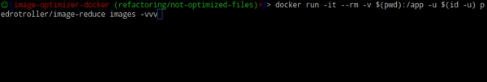

# Image optimization



## Run with Docker

```bash
 $ docker run -it --rm -v $(pwd):/app -u $(id -u) pedrotroller/image-reduce src
```


 - `src`: the location of files to analyze (can be a file path or a folder path)

## Run with PHP

This project is just a wrapper of the [spatie/image-optimizer](https://github.com/spatie/image-optimizer) library.
